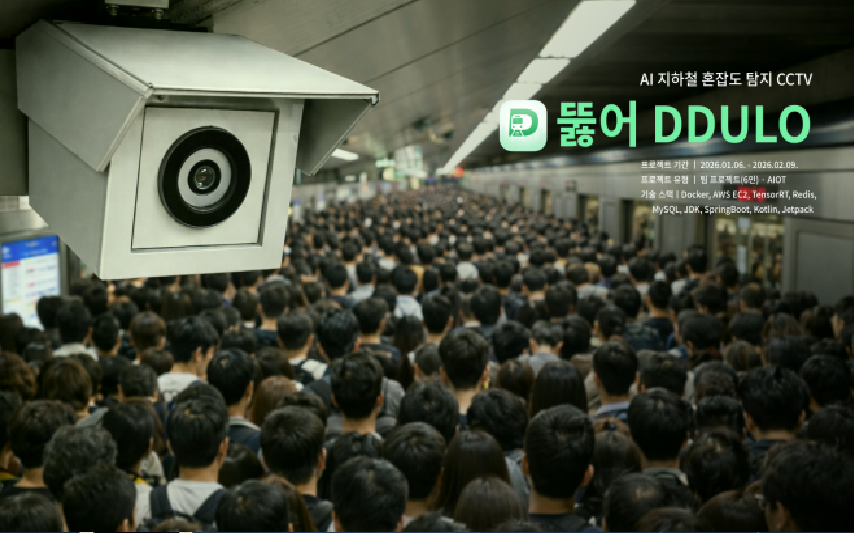
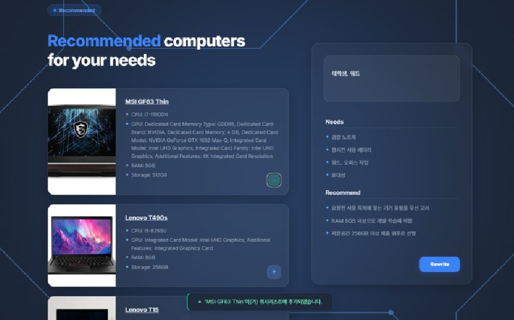
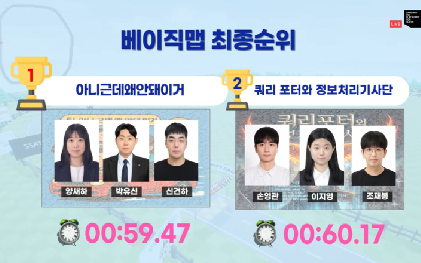
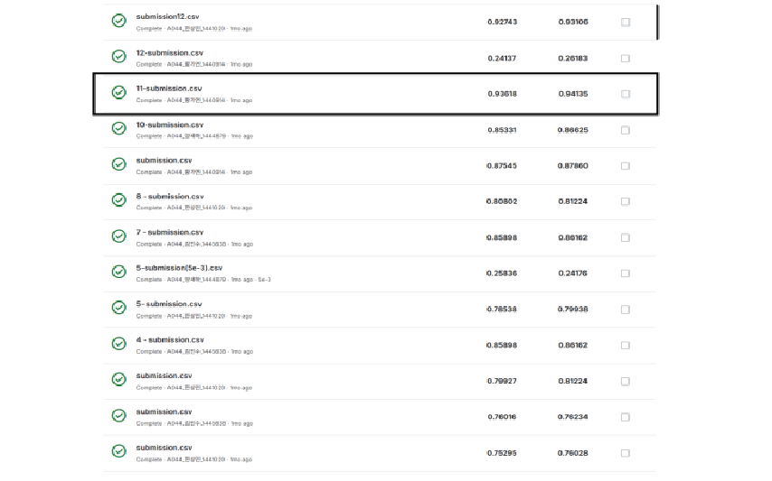
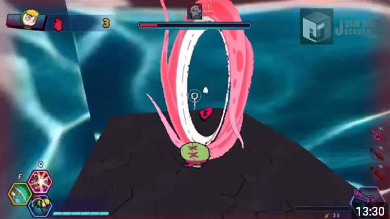
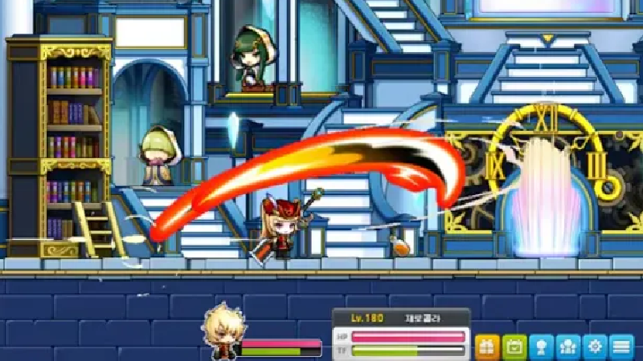

<!--## Hi there 👋-->

<!--
**shynewsky/shynewsky** is a ✨ _special_ ✨ repository because its `README.md` (this file) appears on your GitHub profile.

Here are some ideas to get you started:

- 🔭 I’m currently working on ...
- 🌱 I’m currently learning ...
- 👯 I’m looking to collaborate on ...
- 🤔 I’m looking for help with ...
- 💬 Ask me about ...
- 📫 How to reach me: ...
- 😄 Pronouns: ...
- ⚡ Fun fact: ...
-->

<!--타이틀 부분
align="center" -- 가운데 정렬
type=waving -- 전체 형태
color=gradient -- 색상
customColorList=20 -- 색 팔레트 번호
height=250 -- 높이
section=header -- ?
text=Welcome%20to%20My%20Github -- 윗줄, 자간(%20) 
desc=I'm%20Saeha%20Yang -- 아랫줄, 자간(%20)
animation=fadeIn -- 모든 글자 등장 애니메이션
fontColor=ffffff -- 윗줄 글자 색상
fontSize=50 -- 윗줄 글자 크기
fontAlignY=25 -- 윗줄 글자 상하 위치
descSize=40 -- 아랫줄 글자 크기
descAlignY=50 -- 아랫줄 글자 상하 위치
" />
-->

<!-- 

 -->

# 기획과 디자인을 이해하는  풀스택 프로그래머【 양새하 】입니다.

융합콘텐츠학과에서 **Digital 의 무한한 가능성**을 깨닫고  **Human Computer Interaction (HCI)** 에 대한 관심으로 40여개의 프로젝트를 진행하였습니다.

AI · IOT 를 다루는 4차 산업 서비스 기획 ● AR · VR 를 활용한 모바일 콘텐츠 디자인  ● Unity · Unreal 을 사용한 게임 개발 ● Youtube 영상 제작과 음향 작업 등

**다양한 분야와 직무를 경험**하며 도메인과 직무별 전문 용어를 터득함으로써 **소통 능력**을 길렀고,  **요구사항을 정확하게 파악하여 작업을 진행**할 수 있게 되었습니다.

개발 역량을 쌓기 위해 게임 위주의 프로젝트를 진행하였지만, 
전반적으로 **인간과 디지털이 상호작용하는 다양한 산업**에 열려있습니다.

---

## 🛠 Tech Stack

- <strong>Language</strong> : Python, C, C++, C#, Java
- <strong>Frontend</strong> : HTML, CSS, JS, Bootstrap, Vue.js, Kotlin
- <strong>Backend</strong> : SQL, Django, Sqlite, Springboot
- <strong>AI</strong> : Pytorch, Numpy, Pandas, Seaborn, Matplotlib, Jupyter
- <strong>Game Engine</strong> : Unity, UnrealEngine

---

## 🎯 대표 프로젝트

<table border="1" cellpadding="5" cellspacing="0">
  <tr>
    <td style="width:45%; text-align:center; vertical-align:middle;">
      
    </td>
    <td style="width:45%; text-align:center; vertical-align:middle;">
      
    </td>
  </tr>
  <tr>
    <th>
    <a href="#">지하철 뚫어 DDULO (2026)</a>
    </th>
    <th>
    <a href="https://github.com/MrPCPicker/Mr.PCPicker">Mr.PC Picker (2025)</a>
    </th>
  </tr>
  <tr>
    <th>
      6인 팀 프로젝트 
      Jetson, TensorRT, SpringBoot, Kotlin
    </th>
    <th>
      3인 팀 프로젝트 
      Django REST API, Vue.js, GMS, Sqlite
    </th>
  </tr>
</table>

---

## 🗂️ 그 외 프로젝트

<table border="1" cellpadding="5" cellspacing="0">
  <tr>
    <td style="width:45%; text-align:center; vertical-align:middle;">
      
    </td>
    <td style="width:45%; text-align:center; vertical-align:middle;">
      
    </td>
  </tr>
  <tr>
    <th>
    <a href="https://github.com/No-but-why-not-this/SSAFY_RACE">SSAFY Race (2025)</a>
    </th>
    <th>
    <a href="https://github.com/shynewsky/Ssafy_AIchallenge">SSAFY AI 챌린지 (2025)</a>
    </th>
  </tr>
  <tr>
    <th>
      2인 팀 프로젝트 
      Python, Anaconda, Codex
    </th>
    <th>      
      4인 팀 프로젝트 
      Python, Pytorch, Kaggle
    </th>
  </tr>
</table>

<table border="1" cellpadding="5" cellspacing="0">
  <tr>
    <td style="width:45%; text-align:center; vertical-align:middle;">
      
    </td>
    <td style="width:45%; text-align:center; vertical-align:middle;">
      
    </td>
  </tr>
  <tr>
    <th>
    <a href="https://github.com/shynewsky/JusinSR_RiffleEffect">Riffle Effect (2024)</a>
    </th>
    <th>
    <a href="https://github.com/shynewsky/JusinAPI_Maplestory">Maplestory (2024)</a>
    </th>
  </tr>
  <tr>
    <th>      
      3인 팀 프로젝트 
      C++, DirectX9
    </th>
    <th>
      1인 개인 프로젝트 
      C++, WindowAPI
    </th>
  </tr>
</table>

---

## 💼 Work Experience

- 넥슨코리아 미디어커넥티드본부 단기계약직 (2025.4~2025.6)
- 시온네트웍 기획개발부 인턴 (2022.6.~2022.8)
- 이화여대 생명과학대학원 연구실 영상편집부 단기계약직 (2021.10~2021.10)

---

## 📖 Education

> School

- 이화여자대학교 융합콘텐츠학과(BSc)·디자인학부(BA) 우등 졸업 (2025)
- 한가람고등학교 고급생명·고급영어 우등생 (2018)
- 국제 바칼로레아(IB) 학교 수학·과학 우등생 (2009-2014)

> Academy

- 삼성청년SW·AI아카데미 Python·Web 과정 수강 (2025)
- 쥬신아카데미 C++·DirectX 과정 수강 (2024)

---

## 🏷️ Interest

- <strong>EMB/ROBO</strong> : SSAFY AIoT·IOT(자율주행) 트랙 이수 (2026)
- <strong>HCI/UX</strong> : 이화여대 UX기획&디자인트랙 이수 (2024)
- <strong>ICT/DX</strong> : 이화여대 콘텐츠서비스&기획트랙 이수 (2023)
- <strong>생명과학/의학</strong> : 한가람고 생I·생II·고급생명 이수 (2017)

---

## 💻 Related Activities

> 교과 프로젝트

- UX디자인졸업연구 (2023) - `UrO:사진 속 구름을 띄우는 가상하늘 SNS`
- 융합콘텐츠졸업논문 (2023) - `이앙:수선을 꽃피우다`
- 코드플레이 (2023) - `Marble Music:심리 맞춤 AI 음악 플레이어`
- 콘텐츠시스템프로젝트 (2022) - `내가 크툴루의 이상형이라니, 말도 안되잖아?!`
- 정보인터렉션디자인 (2022) - `뚜두뭉도:트랜스미디어 보물찾기`
- 디지털스토리텔링 (2022) - `불편한편의점:인터렉티브 애니메이션`
- 디자인의이해 (2019) - `토끼:층간소음 예방을 위한 데시벨 피드백 IoT`

> 교외 프로젝트

- Tumblbug 펀딩 및 STEAM 출시 (2023) - `물멍키트`
- 넥슨 슈퍼해커톤 참여 (2022) - `빙의:육체쟁탈전`
- 스마일게이트 슬기로운 데모생활 (2022) - 2개 부문 베스트테스터 선정
- 스마일게이트 온라인게임잼 참여 (2022) - `봄날의프로포즈`, `힛더그린`
- 전국게임제작동아리 GameMakers 활동 (2022) - `미자르와 알고르의 사건수첩`

---

## ✒️ Abilities

> 직무 역량

- <strong>2026.01.02.</strong>ㅣ리눅스마스터 2급
- <strong>2025.03.21.</strong>ㅣ데이터분석준전문가(ADsP)
- <strong>2025.03.01.</strong>ㅣAICE(Basic)
- <strong>2025.02.02.</strong>ㅣPCCE(C++) Lv3
- <strong>2022.08.27.</strong>ㅣMOS Master
- <strong>2020.07.18.</strong>ㅣACA Specialist

> 외국어 역량

- <strong>2024.11.30.</strong>ㅣOPIc English IH
- <strong>2024.11.24.</strong>ㅣTOEIC (950/990)
- <strong>2024.11.16.</strong>ㅣTOEIC Speaking AL (170/200)
- <strong>2022.01.13.</strong>ㅣJLPT N2 (145/180)
- <strong>2019.08.03.</strong>ㅣTOEFL (107/120)

> 해외 경험

- <strong>2020.1.12.-2020.1.21.</strong> (싱가포르) 난양대학교 교류학생
- <strong>2009.6.20.-2014.2.24.</strong> (브라질) 국제 바칼로레아 학교 졸업

---

<!-- ## 📊 GitHub Stats

---  -->

## ⌨️ Algorithm Study

