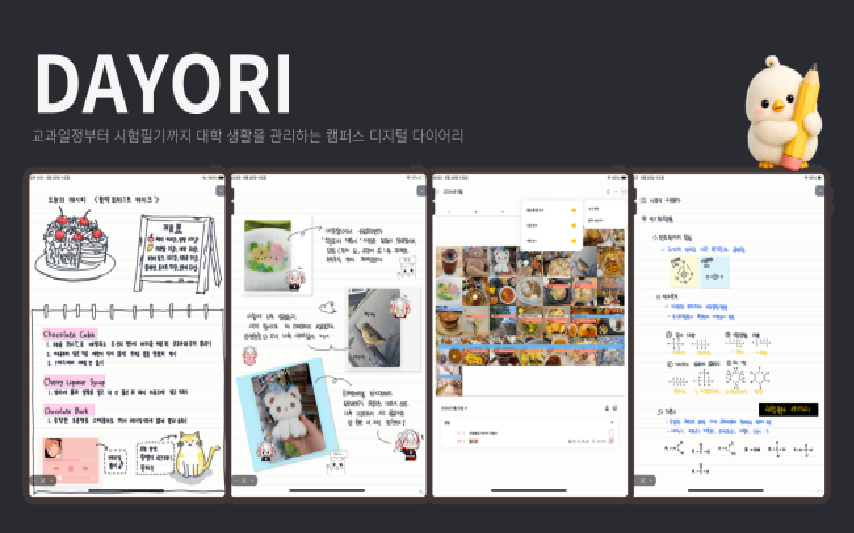
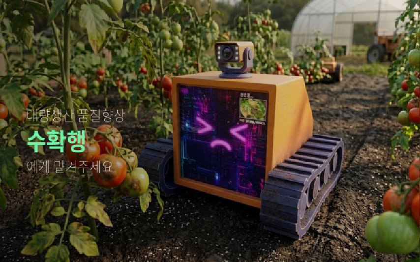
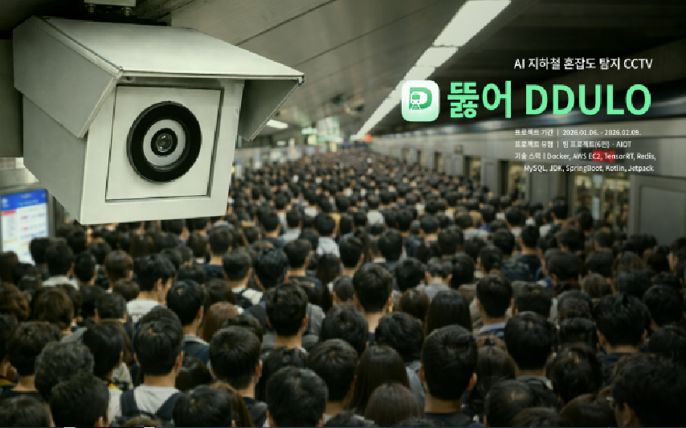
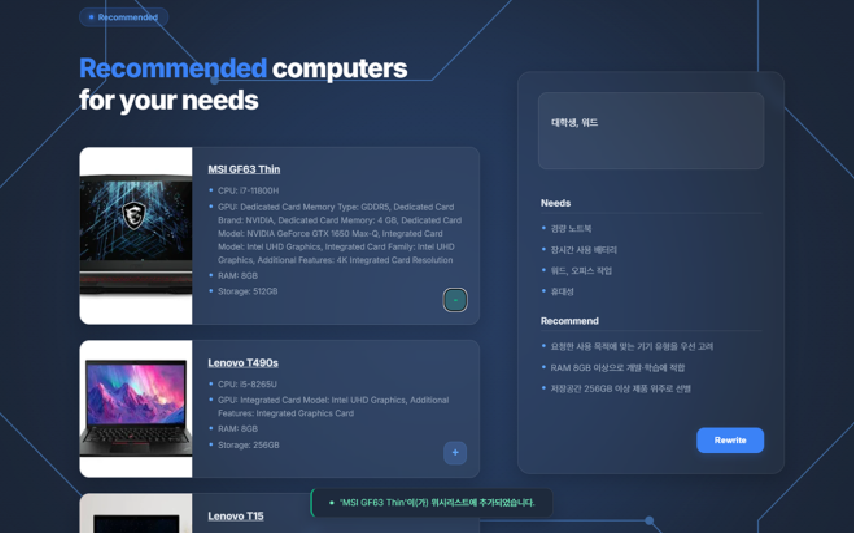

<!--## Hi there 👋-->

<!--
**shynewsky/shynewsky** is a ✨ _special_ ✨ repository because its `README.md` (this file) appears on your GitHub profile.

Here are some ideas to get you started:

- 🔭 I’m currently working on ...
- 🌱 I’m currently learning ...
- 👯 I’m looking to collaborate on ...
- 🤔 I’m looking for help with ...
- 💬 Ask me about ...
- 📫 How to reach me: ...
- 😄 Pronouns: ...
- ⚡ Fun fact: ...
-->

<!--타이틀 부분
align="center" -- 가운데 정렬
type=waving -- 전체 형태
color=gradient -- 색상
customColorList=20 -- 색 팔레트 번호
height=250 -- 높이
section=header -- ?
text=Welcome%20to%20My%20Github -- 윗줄, 자간(%20) 
desc=I'm%20Saeha%20Yang -- 아랫줄, 자간(%20)
animation=fadeIn -- 모든 글자 등장 애니메이션
fontColor=ffffff -- 윗줄 글자 색상
fontSize=50 -- 윗줄 글자 크기
fontAlignY=25 -- 윗줄 글자 상하 위치
descSize=40 -- 아랫줄 글자 크기
descAlignY=50 -- 아랫줄 글자 상하 위치
" />
-->

<!-- 

 -->

# 어려울수록 더 깊고 집요하게 파고드는「양새하」입니다.

### 다양한 선택지 속에서 프로젝트에 맞는 방향을 판단하고,  기획 의도를 구현까지 연결하는 개발자로 성장하고 있습니다.

융합콘텐츠학과에서 **첨단기술 산업** 과 **Human-Computer Interaction(HCI)** 에 대한 관심을 바탕으로 40여 개의 기획·디자인 프로젝트를 수행하며, **실제로 동작하는 시스템을 구현하고 싶다는 목표** 가 생겼고, 쥬신아카데미와 삼성청년SW·AI아카데미에 입과하여 본격적으로 개발 역량을 쌓았습니다.

삼성청년SW·AI아카데미에서는 **Python 기반 알고리즘 역량**과 **Web Full Stack** 개발 역량을 강화했으며, **AIoT 및 자율주행(IoT) 프로젝트** 에서 **Jetson, ROS2, Gazebo** 등을 활용해 IoT 소프트웨어 설계 및 구현을 담당하였습니다.

기획·디자인부터 개발까지 **다양한 직무를 경험** 하며 도메인별 전문 용어와 협업 방식을 익혔고, 이를 통해 요구사항을 정확히 **분석**하고 기술적으로 **구현**하는 역량과 원활한 **소통** 능력을 갖추게 되었습니다.

초기에는 게임 중심의 프로젝트로 개발 기초를 다졌지만, 현재는 **인간과 디지털 기술이 상호작용하는 디지털·IT 산업 전반**에서 사용성을 증대시키는 소프트웨어 개발자로 성장하고자 합니다.

---

## 🛠 Tech Stack

- <strong>Language</strong> : Python, C, C++, C#, Java
- <strong>Frontend</strong> : HTML, CSS, JS, Bootstrap, Vue.js, Kotlin
- <strong>Backend</strong> : Django, Springboot, FastAPI
- <strong>DB</strong> : SQL, Sqlite, Redis, MySQL, Postgresql
- <strong>AI</strong> : Jupyter, Pytorch, TensorRT
- <strong>OS</strong> : Window, Ubuntu(Linux)
- <strong>Simulator</strong> : Unity, UnrealEngine, Gazebo

---

## 🎯 대표 프로젝트

<table border="1" cellpadding="5" cellspacing="0">
  <tr>
    <td style="width:45%; text-align:center; vertical-align:middle;">
      
    </td>
    <td style="width:45%; text-align:center; vertical-align:middle;">
      
    </td>
  </tr>
  <tr>
    <th>
    <a href="#">Dayori(2026/6인)</a>
    </th>
    <th>
    <a href="#">수확행(2026/5인)</a>
    </th>
  </tr>
  <tr>
    <th>
      Springboot, Jenkins, AWS EC2, Flutter
    </th>
    <th>
      ROS2, Gazebo, FastAPI, Postgresql, React
    </th>
  </tr>
</table>

<table border="1" cellpadding="5" cellspacing="0">
  <tr>
    <td style="width:45%; text-align:center; vertical-align:middle;">
      
    </td>
    <td style="width:45%; text-align:center; vertical-align:middle;">
      
    </td>
  </tr>
  <tr>
    <th>
    <a href="#">뚫어 DDULO (2026/5인)</a>
    </th>
    <th>
    <a href="https://github.com/MrPCPicker/Mr.PCPicker">Mr.PC Picker (2025/2인)</a>
    </th>
  </tr>
  <tr>
    <th>
      Jetson, TensorRT, YOLOv8, MQTT, Kotlin
    </th>
    <th>
      Django REST API, Vue.js, GMS, Sqlite
    </th>
  </tr>
</table>

---

## 🗂️ 그 외 프로젝트

- <a href="https://github.com/No-but-why-not-this/SSAFY_RACE">SSAFY Race (2025/3인) </a> - Python, Anaconda, Codex
- <a href="https://github.com/shynewsky/Ssafy_AIchallenge">SSAFY AI 챌린지 (2025/4인)</a> - Python, Pytorch, Kaggle
- <a href="https://github.com/shynewsky/JusinSR_RiffleEffect">Riffle Effect (2024/3인)</a> - C++, DirectX9
- <a href="https://github.com/shynewsky/JusinAPI_Maplestory">Maplestory (2024/1인)</a> - C++, WindowAPI

---

## 💼 Work Experience

- 넥슨코리아 미디어커넥티드본부 아르바이트 (2025.4~2025.6)
- 시온네트웍 기획개발부 인턴 (2022.6.~2022.8)
- 이화여대 생명과학대학원 연구실 영상편집부 아르바이트 (2021.10~2021.11)
- 이화여대 신산업융합대학 근로장학생 (2020.09~2020.12)
- 이화여대 식품영양대학원 연구실 이푸드랩 아르바이트 (2019.11~2019.12)

---

## 📖 Education

> 학력사항

- 이화여자대학교 융합콘텐츠(BSc)·디자인(BA) 우등 졸업 (2019-2025)
- 한가람고등학교 고급생명·고급영어 교과우수 및 우등상 (2015-2018)
- 국제 바칼로레아(IB) 학교 수학·과학 교과우수 (2009-2014)

> 교육이수

- 삼성청년SW·AI아카데미 Python·Web 과정 수강 (2025-2026)
- 쥬신아카데미 C++·DirectX 과정 수강 (2024)

---

## 🏷️ Interest

- <strong>EMB/ROBO</strong> : SSAFY AIoT·IoT(자율주행) 트랙 이수 (2026)
- <strong>HCI/UX</strong> : 이화여대 UX기획&디자인트랙 이수 (2024)
- <strong>ICT/DX</strong> : 이화여대 콘텐츠서비스&기획트랙 이수 (2023)
- <strong>생명과학/의학</strong> : 한가람고 생I·생II·고급생명 이수 (2017)

---

## 🏆 Awards

> 수상이력

- <strong>2026.02.23.</strong>ㅣSSAFY 공통프로젝트 우수상 (서울 2반 3위)

> 특이사항

- <strong>2026.04.15.</strong>ㅣSSAFY 베스트 맴버 (서울 6반 4월)
- <strong>2026.01.09.</strong>ㅣSSAFY RACE 이벤트맵·베이직맵·스피드맵 1위
- <strong>2025.11.12.</strong>ㅣSSAFY 이달의 동료 (서울 4반 10월)
- <strong>2025.07.30.</strong>ㅣSSAFY 이달의 동료 (서울 4반 7월)
- <strong>2024.12.06.</strong>ㅣMapleCon 홍보 서포터즈 선정
- <strong>2022.11.16.</strong>ㅣ넥슨 슈퍼해커톤 브이로그 부문 2등
- <strong>2020.01.25.</strong>ㅣ신산업융합대학 야구점퍼 디자인 우승

---

## ✒️ Abilities

> 직무 역량

- <strong>2026.03.27.</strong>ㅣSQL개발자(SQLD)
- <strong>2026.01.02.</strong>ㅣ리눅스마스터 2급
- <strong>2025.04.18.</strong>ㅣ컴퓨터그래픽기능사
- <strong>2025.03.21.</strong>ㅣ데이터분석준전문가(ADsP)
- <strong>2025.03.01.</strong>ㅣAICE(Basic)
- <strong>2025.02.02.</strong>ㅣPCCE(C++) Lv3
- <strong>2022.08.27.</strong>ㅣMOS Master
- <strong>2020.07.18.</strong>ㅣACA Specialist

> 외국어 역량

- <strong>2024.11.30.</strong>ㅣOPIc English IH
- <strong>2024.11.24.</strong>ㅣTOEIC (950/990)
- <strong>2024.11.16.</strong>ㅣTOEIC Speaking AL (170/200)
- <strong>2022.01.13.</strong>ㅣJLPT N2 (145/180)
- <strong>2019.08.03.</strong>ㅣTOEFL (107/120)

> 해외 경험

- <strong>2020.1.12.-2020.1.21.</strong> (싱가포르) 난양대학교 교류학생
- <strong>2009.6.20.-2014.2.24.</strong> (브라질) 국제 바칼로레아 학교 졸업

---

<!-- ## 📊 GitHub Stats

---  

## ⌨️ Algorithm Study

--- -->

## 💻 Other Projects

> 교과 프로젝트 - 사용자경험

- UX디자인졸업연구 (2023) - `UrO:둥 - 사진 속 구름을 띄우는 가상하늘 SNS`
- 정보인터렉션디자인 (2022) - `뚜두뭉도 - 트랜스미디어 보물찾기 기획`
- UX디자인 (2022) - `산부인과 - 프라이빗한 접수/소변검사 장소 제공 제안`
- UI디자인 (2021) - `슈퍼루키 - 커리어맵&루키챗 추가로 차별화 전략 제안`
- 사용자연구 (2020) - `노션 - 사용자테스트로 모바일UI 문제 발견 및 개선안 제안`
- 콘텐츠아키텍처링 (2020) - `과제도우미 - 학술 자료 포탈 사이트 기획`
- 메트로휠러 (2019) - `메트로휠러 - 휠채어&유모차를 위한 역 내 길찾기 서비스`
- 디자인의이해 (2019) - `토끼키우기 - 층간소음 예방 데시벨 피드백 인터폰 IoT`

> 교과 프로젝트 - 콘텐츠 기획

- 융합콘텐츠졸업논문 (2023) - `이앙:수선을 꽃피우다 - 퍼즐 비주얼노벨 개발`
- 콘텐츠시스템프로젝트 (2022) - `내가 크툴루의 이상형이라니, 말도 안되잖아?!`
- 디자인익스프레션 (2023) - `QR 코드와 AR RPG를 활용한 홍보 마케팅 아이디어`
- 디지털스토리텔링 (2022) - `불편한편의점 - 인터렉티브 애니메이션 기획·개발`
- 코드플레이 (2023) - `Marble Music - 심리 맞춤 AI 음악 플레이어`
- 디지털그래픽스 (2022)  - `골든타임 - 의료 사각지대 경각심을 제기하는 웹디자인`
- 디지털그래픽스 (2022) - `AR동물원 - 동물 전시를 예방하는 AR 동물원 콘텐츠`
- 크리에이티브라이팅 (2021) - `진달래 - 이데올로기 악령을 퇴치하는 엑소시스트 세계관`
- 일본콘텐츠투어리즘 (2020) - `나도!런닝맨 - 성지순례를 활용한 전국 관광 활성화 콘텐츠`
- 디지털스토리텔링개론 (2019) - `헨젤엔그레텔 - 인터렉티브 스토리텔링 각색`

> 교과 프로젝트 - 시각 디자인

- 디자인아트졸업연구 (2023) - `Vtuber - 퍼스널브랜딩 생태계 및 IP전략 연구`
- 그래픽디자인 (2023) - `학교생활 - 학교폭력을 재미로 승화시킨 놀이북`
- 머테리얼플레이 (2023) - `단성 - 고온파라핀과 양모펠트를 활용한 재료 연구`
- 환경색채학 (2022) - `서울갈산초등학교 - 주변 환경에 어울리는 외벽 리디자인`
- 디자인리서치 (2022) - `인체 비율을 적용한 캐릭터 원화용 체형 리서치 북`
- 타이포그래피 (2020) - `빗방울체 - 영화 '날씨의아이'를 모티프로 한 폰트 개발`

> 교외활동 - 게임개발

- 쥬신아카데미 게임 모작 (2025) - `메이플스토리`,`리플이펙트`
- Tumblbug 펀딩 및 STEAM 출시 (2023) - `물멍키트`
- 넥슨 슈퍼해커톤 참여 (2022) - `빙의:육체쟁탈전`
- 스마일게이트 슬기로운 데모생활 (2022) - `카투바의 밀렵꾼`, `스태퍼케이스` 베스트테스터
- 스마일게이트 온라인게임잼 참여 (2022) - `봄날의프로포즈`,`힛더그린`,`모노스키아`
- 전국게임제작동아리 GameMakers 6기 (2022) - `미자르와 알고르의 사건수첩`
- 대학연합게임제작동아리 Bridge 8기 (2020) - `할망`

> 교외활동 - 일러스트레이터

- 목포 쿠레레 갤러리 단체전 (2025) - `POETRY OF COLORS : 색감의 시`
- 신도림 현대백화점 단체전 (2025) - `SERENDIPITY:세렌디피티`
- 김해 도슨트갤러리 단체전 (2025) - `발랜타인:VALENTINE` 
- 충정로 붐박스 단체전 (2025) - `아날로그 웨이브:아임,그리다` 
- 네이버 스티커 출시 (2024) - `묘호티콘1 - 희노애락` 
- 작가와 무료표지 9종 기부 (2024) - `태양이 거실벽에 추상화를 그린다`
- 압구정 빈칸 일러닷 참여 (2023) - `서묘호`
- 디지털드로잉 아트스터디 참여 (2022)

> 교외활동 - SNS

- Threads `서묘호` (2023-2025) - RVC·UVR5 활용 AI Cover 연구
- Instagram `서묘호` (2020-2025) - 캐릭터 디자인 및 MMD 콘텐츠 연구
- Youtube `메이플1분요약` (2020-2025) - 비디오 165개, 쇼츠 129개, 라이브 319회
- Youtube `이화그린걸즈` (2021) - 1,2화 제작
- Youtube `이화여대 수강신청 튜토리얼` 제작 (2020,2022)