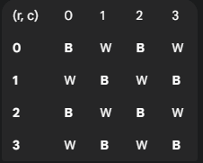

# 1️⃣ 내 코드

### 1) 백트래킹 ㅡ 시간초과 O(2^N)

```python
import sys
sys.stdin = open('input.txt')
from pprint import pprint

'''
방1) ㅡ 시간초과
백트래킹, 상태트리
'''

# 함수 ------------------------------------------------------------------

def recur(cnt, candidates): # cnt 깊이(비숍개수), candidate(다음에 놓을 수 있는 후보)
    global max_cnt

    if not candidates: # 종료조건 : 남은 후보군이 없을때
        if max_cnt < cnt:
            max_cnt = cnt
        return

    for candidate in candidates: # 후보군 마다, 다음 재귀의 후보군 새로 만들기
        x, y = candidate                  # 기준 후보
        new_candidates = candidates[:]    # 깊은 복사
        new_candidates.remove(candidate)  # 기준 후보도 다음 후보군에서 제거

        for d in range(4): # 가지치기 : 델타 순회로 대각선 4방향 제거

            while True:
                nx, ny = x+dx[d], y+dy[d]
                if not (0<=nx<N and 0<=ny<N): # 범위 벗어나면 방향전환
                    break
                if (nx, ny) in new_candidates: # 후보군에 있으면 제거
                    new_candidates.remove((nx, ny))
                x, y = nx, ny  # 다음 좌표 탐색을 위한 갱신

            if not new_candidates: # 후보군이 비어있으면
                break

        recur(cnt+1, new_candidates)

# 입력 ----------------------------------------------------------------
N = int(input()) # 10이하의 수 ㅡ 재귀 가능
board = [list(map(int, input().split())) for _ in range(N)]
'''
[[1, 1, 0, 1, 1],
 [0, 1, 0, 0, 0],
 [1, 0, 1, 0, 1],
 [1, 0, 0, 0, 0],
 [1, 0, 1, 1, 1]]
'''

# 변수 ------------------------------------------------------------------
candidates = [(i,j) for i in range(N) for j in range(N) if board[i][j]]
M = len(candidates) # 13
'''
[(0, 0), (0, 1), (0, 3), (0, 4), (1, 1), (2, 0), (2, 2), (2, 4), (3, 0), (4, 0), (4, 2), (4, 3), (4, 4)]
'''

# 코드 ------------------------------------------------------------------
# 상태트리가 그려지므로 - 백트래킹 사용
# candidate 를 모두 순회할때까지 재귀
# delta 로 candidate 가지치기

max_cnt = 0
dx = [-1, -1, 1, 1]
dy = [-1, 1, -1, 1]

recur(0, candidates)

print(max_cnt+1)
```

### 2) "회의실 예약" ㅡ 오류

```python
import sys
sys.stdin = open('input.txt')
from pprint import pprint

'''
방2) ㅡ 오류
회의실 예약하듯이, 하나 선택하면 연결된 모든 대각선의 후보군을 지운다
'''

# 입력 ----------------------------------------------------------------
N = int(input()) # 10이하의 수 ㅡ 재귀 가능
board = [list(map(int, input().split())) for _ in range(N)]

# 변수 ------------------------------------------------------------------
candidates = [(i,j) for i in range(N) for j in range(N) if board[i][j]]
M = len(candidates) # 13

# 코드 ------------------------------------------------------------------

dx = [-1, -1, 1, 1]
dy = [-1, 1, -1, 1]

for candidate in candidates:
    for d in range(4):  # 가지치기 : 델타 순회로 대각선 4방향 제거
        x, y = candidate  # 기준 후보

        while True:
            nx, ny = x + dx[d], y + dy[d]
            if not (0<=nx<N and 0<=ny<N): # 범위 벗어나면 방향전환
                break
            if (nx, ny) in candidates:  # 후보군에 있으면 제거
                candidates.remove((nx, ny))

            x, y = nx, ny  # 다음 좌표 탐색을 위한 갱신

print(len(candidates))
```

# 3️⃣ 분기한정 백트래킹 (Branch & Bound)

- 체스판이 아래와 같을때, 검은색 칸은 (r+c)%2==0 인 위치



- 1차원 인덱스 `idx`를 사용하여 보드 탐색


- 현재 칸의 위치 : `(r+c) % 2`
- 탐색중인 그룹 색상 : `color` (검정0, 흰색1)
- 이동할 수 있는 위치 : `(r+c)%2 == color`

```python
    r, c = idx // N, idx % N 
    if (r + c) % 2 == color: # 이동할 수 있는 칸 
        if board[r][c] == 1: # 갈 수 있는 칸 1
            if not diag_right[r+c] and not diag_left[(r-c)+(N-1)]: # 대각선 충돌 체크
                pass
    else: # 이동할 수 없는 칸
        dfs(idx + 1, count, color) # 다음 칸으로 순회 진행
```

<hr>

```python
import sys
sys.setrecursionlimit(10 ** 6) # 재귀 깊이 제한 증가 (백트래킹 사용 시 필요)

# 전역 변수 설정
N = 0
board = []
diag_right = []      # ↗ 방향 대각선: r + c (0 ~ 2*N-2)
diag_left = []       # ↖ 방향 대각선: r - c + N - 1 (0 ~ 2*N-2)
max_bishops = [0, 0] # [0: 검은색 칸 최대, 1: 흰색 칸 최대]

def dfs(idx, count, color):
    """
    비숍을 놓는 백트래킹 함수
    idx: 현재 탐색할 칸의 인덱스 (0부터 N*N-1)
    count: 현재까지 놓은 비숍 수
    color: 0 (검은색 칸) 또는 1 (흰색 칸)
    """
    global N, board, diag_right, diag_left, max_bishops

    if idx == N * N: # 모든 칸 탐색 완료
        max_bishops[color] = max(max_bishops[color], count)
        return

    r, c = idx // N, idx % N # 현재 칸의 색깔: (r + c) % 2. (검은색: 0, 흰색: 1)

    # 1. 현재 탐색 색깔(color)과 칸의 색깔이 일치하는 경우
    if (r + c) % 2 == color:
        if board[r][c] == 1:  # 비숍을 놓을 수 있는 칸이고
            if not diag_right[r + c] and not diag_left[r - c + N - 1]: # 대각선 충돌 체크

                # 1-1. 비숍을 놓는 경우
                diag_right[r + c] = True
                diag_left[r - c + N - 1] = True

                # 다음 칸 탐색
                dfs(idx + 1, count + 1, color)

                # 백트래킹: 상태 복원
                diag_right[r + c] = False
                diag_left[r - c + N - 1] = False

        # 1-2. 비숍을 놓지 않는 경우 (board[r][c] == 0 이거나, 놓을 수 있지만 안 놓는 경우)
        dfs(idx + 1, count, color)

    # 2. 현재 탐색 색깔과 칸의 색깔이 다른 경우 (다른 색깔 칸)
    else:
        dfs(idx + 1, count, color) # 다음 칸으로 넘어간다 (count에 영향을 주지 않음)


def solve():
    global N, board, diag_right, diag_left

    # 입력 처리 및 전역 변수 초기화
    try:
        N = int(sys.stdin.readline())
        for _ in range(N):
            board.append(list(map(int, sys.stdin.readline().split())))

    except:
        print(0)
        return

    # 대각선 배열 크기 초기화
    diag_size = 2 * N - 1

    # === 1. 검은색 칸 탐색 (color=0) ===
    # 상태 배열 초기화
    diag_right = [False] * diag_size
    diag_left = [False] * diag_size
    dfs(0, 0, 0)

    # === 2. 흰색 칸 탐색 (color=1) ===
    # 상태 배열 초기화 (다시)
    diag_right = [False] * diag_size
    diag_left = [False] * diag_size
    dfs(0, 0, 1)

    # 결과 출력
    print(max_bishops[0] + max_bishops[1])

solve()
```

