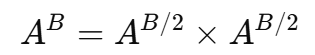

# 분할정복

> **A를 B번 곱한 값에 mod C를 취하라**

* B는 최대 **21억**
* (A^B)%C 는 **불가능**

---

> 거듭제곱은 “반으로 쪼개진다”



* 깊이는 **log₂B**

---

> 나머지연산의 중요한 원리


* **중간 계산 결과가 아무리 커져도**
* mod를 계속 씌우면 값이 폭발하지 않는다

---

> **곱셈이 일어나는 모든 지점에서 mod C 적용**

---

* 분할정복이므로 재귀 함수로 설계

```python
def power(a, b):
```

---

* 더 이상 쪼갤 수 없는 최소 문제 (베이스 케이스)

```python
    if b == 1:
        return a % C
```
---

### 분할단계
* 문제를 **절반 크기 문제로 분해**
* 일단 A^(b//2)를 먼저 계산해둔다

```python
    half = power(a, b // 2)
```

---

### 홀짝 분기

```python
    if b % 2 == 0:
        return (half * half) % C
    else:
        return (half * half * a) % C
```
