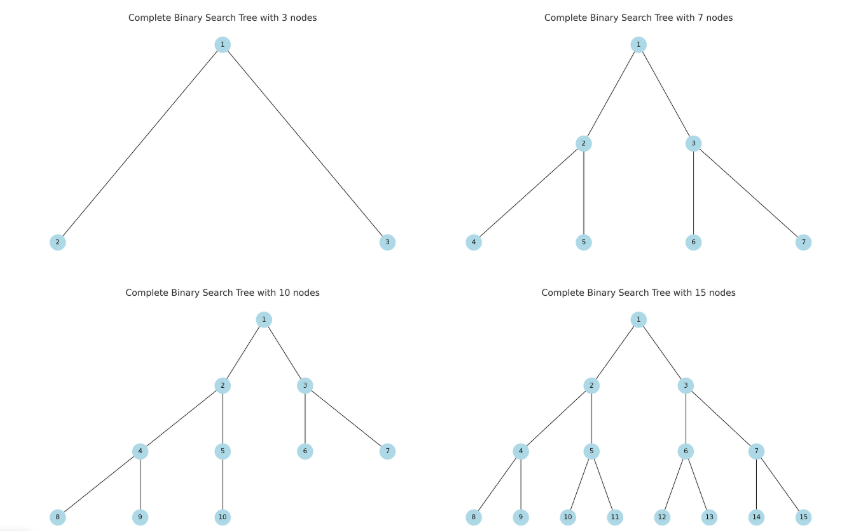

# 완전이진트리

> 풀이 개요

- 완전 이진 트리 만든 후에
- 중위순회(LVR)을 하며 값을 1부터 N까지 채운다

> 완전 이진 트리

- 루트를 만든다
- 왼쪽 자식, 오른쪽 자식 순서대로 붙여나간다
- N 개의 노드를 다 채울때까지 반복한다
- => 노드 번호를 레벨 순서대로 붙이면 완전 이진 트리 모양이 자동으로 나온다

- 포화이진트리 : 노드 개수를 2^n -1 개로 설정하여, 왼쪽 오른쪽 자식을 순서대로 붙여나간다
